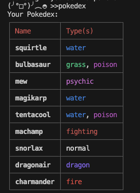

## Overview

ts_pokedex is a lightweight CLI REPL application that lets you explore Pokémon data by location. It utilizes the [PokeApi](https://pokeapi.co/docs/v2#info) to get details about the pokemon universe. It also utilizes simple cache mechanism for recent queries to the API.

### Features

- Interactive REPL: Enter commands like map <location-area> to list available Pokémon.
- Pagination support: Navigate through paginated results (next, prev).
- Colorized output using chalk, highlighting Pokémon types in their signature colors.
- Well-typed with TypeScript, keeping API calls and state management robust.
- Test suite using Vitest, with mocked PokeAPI and CLI I/O.

## Test Coverage

| Statements                  | Branches                | Functions                 | Lines             |
| --------------------------- | ----------------------- | ------------------------- | ----------------- |
|  |  |  |  |


<!-- coverage-badge:start -->
<!-- coverage-badge:end -->


## Getting Started
### Prerequisites
- Node.js (v18+ recommended)
- Git for cloning

### Installation
```
git clone https://github.com/gingerknight/ts_pokedex.git
cd ts_pokedex
npm install
```

### Run the REPL
```
npm run dev
```
You will be greeted with a prompt like this:
```
~/dev/ts_pokedex main
❯ npm run dev

> ts_pokedex@1.0.0 dev
> npx tsc && node dist/main.js

(╯°□°)╯︵◓ >>
```
> Use `help` to get learn what commands are available

There is now color and table formatting for the pokedex printout. 



### Project Structure
```
src/
├── command_map.ts      ← `map` command logic
├── command_map_back.ts ← `prev` command logic
├── repl.ts             ← REPL loop & input handling
├── pokeapi.ts          ← API client for fetching Pokémon data
├── state.ts            ← Shared state (commands, pokeApi, pagination)
└── ...                 ← Other commands and utils
tests/
├── cmd_map.test.ts
├── repl.test.ts
└── ...other tests
```

## Writing Tests
Vitest is the test running. You can write tests for:
- Pure Logic (cleanInput, parseCommand)
- UI commands (commandMap, commandMapBack) with mocks and console spies
- Error normalization and graceful fallback behavior

To run tests:
```
npm run test
```

## Future Enhancements
- ~~Add rich temrinal enhancements like colors for pokemon types, and table formatting~~
- Package as global CLI (avilable via npm)
- Simulate battles between pokemon
- Add more unit tests
- Keep pokemon in a "party" and allow them to level up
- Allow for pokemon that are caught to evolve after a set amount of time
- Persist a user's Pokedex to disk so they can save progress between sessions
- Use the PokeAPI to make exploration more interesting. For example, rather than typing the names of areas, maybe you are given choices of areas and just type "left" or "right"
- Random encounters with wild pokemon
- Adding support for different types of balls (Pokeballs, Great Balls, Ultra Balls, etc), which have different chances of catching pokemon
